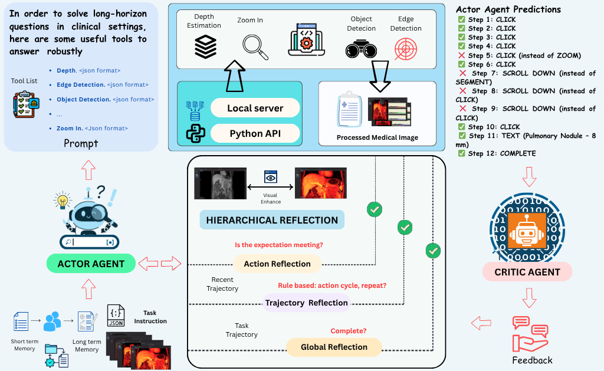
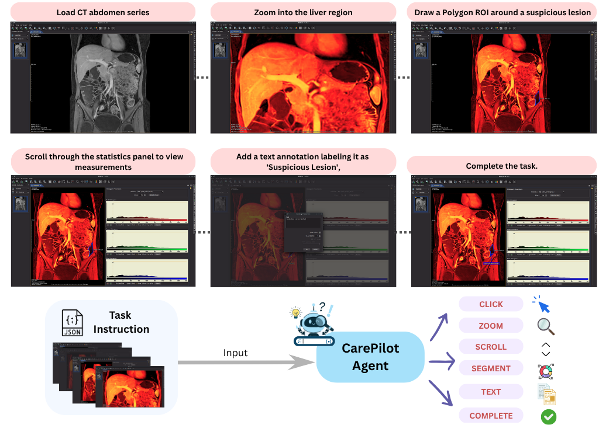
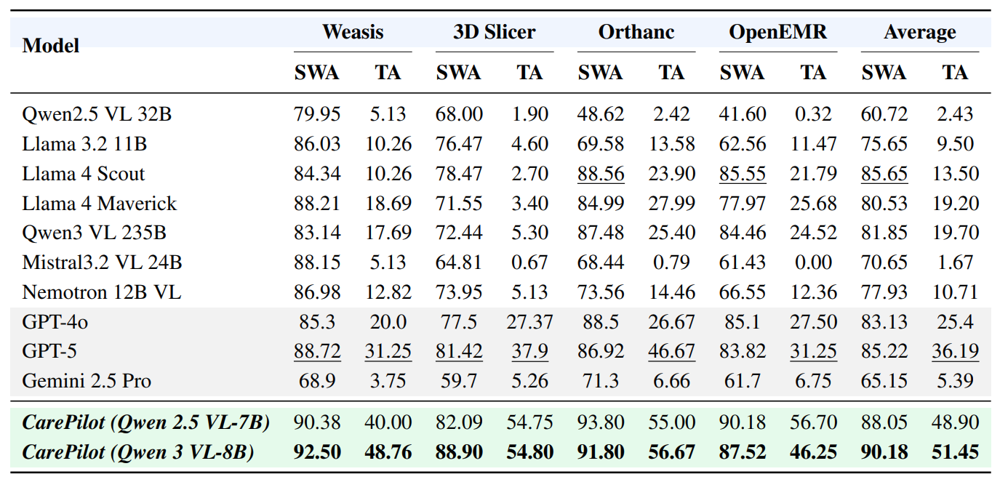

# CarePilot

A comprehensive medical visual agent system with agentic pipeline and model fine-tuning capabilities.

## Abstract

Multimodal agentic pipelines are transforming human–computer interaction by enabling efficient and accessible automation of complex, real-world tasks. However, recent efforts have focused on short-horizon or general-purpose applications (e.g., mobile or desktop interfaces), leaving long-horizon automation for domain-specific systems, particularly in healthcare, largely unexplored.

To address this, we introduce CareFlow, a high-quality human-annotated benchmark comprising complex, long-horizon software workflows across medical annotation tools, DICOM viewers, EHR systems, and laboratory information systems. On this benchmark, existing vision–language models (VLMs) perform poorly, struggling with long-horizon reasoning and multi-step interactions in medical contexts.

To overcome this, we propose **CarePilot**, a multi-agent framework based on the actor–critic paradigm. The Actor integrates tool grounding with dual-memory mechanisms, long-term and short-term experience, to predict the next semantic action from the visual interface and system state. The Critic evaluates each action, updates memory based on observed effects, and either executes or provides corrective feedback to refine the workflow. Through iterative agentic simulation, the Actor learns to perform more robust and reasoning-aware predictions during inference. Our experiments show that **CarePilot** achieves state-of-the-art performance, outperforming strong closed-source and open-source multimodal baselines by approximately **15.26%** and **3.38%**, on our benchmark and out-of-distribution dataset, respectively.

## Overview

CarePilot consists of two main components:

1. **Agentic Pipeline**: An agent-based system that uses target and critic agents to process medical imaging tasks through a hierarchical reflection architecture.
2. **Finetuning**: Supervised fine-tuning (SFT) code for training vision-language models on task results.

## Architecture


Overview of the **CarePilot** framework. 
An Actor–Critic multi-agent architecture governs hierarchical decision-making for long-horizon healthcare workflows. 
At each step, the **Actor** observes the current interface and instruction, integrates tool-grounding signals, and its past experience that is stored in short- and long-term memories, and predicts the next semantic action.  The **Critic** evaluates outcomes, provides corrective feedback, and updates both short-term and long-term memory buffers to guide subsequent decisions.



## Task Execution Flow

The system processes medical imaging tasks through a sequence of steps:



## Performance Results

CarePilot achieves state-of-the-art performance on medical imaging tasks:



## Structure

```
CarePilot/
├── Agentic_Pipeline/    # Agentic pipeline with target/critic agents
├── Finetuning/          # Model fine-tuning code
│   ├── training/        # Training scripts
│   └── test/            # Evaluation and testing scripts
├── figures/             # Architecture diagrams and results
├── requirements.txt     # Unified requirements
└── README.md           # This file
```

## Quick Start

### Prerequisites

- Python 3.8+
- CUDA-capable GPU (recommended for finetuning)
- API keys for:
  - Deep Infra (for agentic pipeline)
  - HuggingFace (for datasets and models)

### Installation

1. Clone the repository:
```bash
git clone <repository-url>
cd CarePilot
```

2. Install dependencies:
```bash
pip install -r requirements.txt
```

For finetuning, you may also need PyTorch with CUDA support:
```bash
# For CUDA 11.8
pip install torch torchvision torchaudio --index-url https://download.pytorch.org/whl/cu118

# For CPU only
pip install torch torchvision torchaudio
```

3. Set up environment variables:
```bash
export HF_TOKEN="your_huggingface_token"
export DEEPINFRA_TOKEN="your_deepinfra_token"
```

Or create a `.env` file:
```bash
echo "HF_TOKEN=your_huggingface_token" > .env
echo "DEEPINFRA_TOKEN=your_deepinfra_token" >> .env
```

### Usage

#### Agentic Pipeline

1. Navigate to the Agentic Pipeline directory:
```bash
cd Agentic_Pipeline
```

2. Run a single task:
```bash
python main.py --mode original --goal "Load the MRI scan, create a segmentation of the tumor, and measure its volume."
```

3. Run with dataset:
```bash
python main.py --mode dataset --max_tasks 5
```

4. Run with enhanced components:
```bash
python main.py --mode enhanced --goal "Load the MRI scan, create a segmentation of the tumor, and measure its volume."
```

**Command Line Arguments:**
- `--mode`: Implementation mode (`original`, `enhanced`, `revpt`, `integration`, `dataset`)
- `--goal`: User goal/task to execute
- `--mock`: Use mock implementations for tools (default: True)
- `--max_tasks`: Maximum number of tasks to process from dataset
- `--start_task`: Starting task index (0-indexed)
- `--dataset`: HuggingFace dataset name to use
- `--token`: HuggingFace API token
- `--verbose`: Enable verbose logging
- `--no-tools`: Disable tool calls (visual grounding, OCR, etc.)

See [Agentic_Pipeline/README.md](Agentic_Pipeline/README.md) for detailed instructions.

#### Finetuning

**Training:**

1. Navigate to the training directory:
```bash
cd Finetuning/training
```

2. Run training:
```bash
python train.py \
    --train_csv path/to/task_results.csv \
    --model_name Qwen/Qwen3-VL-8B-Instruct \
    --output_dir outputs/model_name \
    --num_epochs 2 \
    --learning_rate 2e-4
```

**Evaluation:**

1. Navigate to the test directory:
```bash
cd Finetuning/test
```

2. Run evaluation:
```bash
python evaluate.py \
    --model_path ../training/outputs/model_name \
    --test_csv path/to/test_results.csv \
    --output_dir results/
```

**Training Arguments:**
- `--train_csv`: Path to training CSV (default: task_results.csv)
- `--task_start`: Starting task ID for training
- `--task_end`: Ending task ID for training
- `--val_split`: Validation split ratio (default: 0.1)
- `--model_path`: Local path to model
- `--model_name`: Model name from HuggingFace
- `--use_local`: Use local model instead of HuggingFace
- `--output_dir`: Output directory for checkpoints
- `--learning_rate`: Learning rate (default: 2e-4)
- `--num_epochs`: Number of training epochs (default: 2)
- `--batch_size`: Batch size (default: 1)
- `--gradient_accumulation_steps`: Gradient accumulation steps (default: 32)

**Evaluation Arguments:**
- `--model_path`: Path to fine-tuned model
- `--test_csv`: Path to test CSV
- `--output_dir`: Output directory for results
- `--batch_size`: Batch size for evaluation
- `--max_tasks`: Maximum number of tasks to evaluate

See [Finetuning/README.md](Finetuning/README.md) for detailed instructions.

## Components

### Agentic Pipeline

The agentic pipeline implements a target-critic architecture where:
- **Target Agent**: Proposes actions based on visual perception and memory
- **Critic Agent**: Provides hierarchical reflection and feedback on actions
- **Visual Tools**: Object detection, depth estimation, edge detection, zooming, and visual grounding
- **Memory System**: Short-term and long-term memory for tracking progress

### Finetuning

The finetuning component provides:
- **Training**: Supervised fine-tuning of vision-language models using LoRA
- **Evaluation**: Model evaluation on test datasets
- **Inference**: Sequential step prediction with memory propagation

## Configuration

API keys should be set via environment variables:
- `HF_TOKEN`: HuggingFace API token
- `DEEPINFRA_TOKEN`: Deep Infra API token

Configuration files are located in:
- `Agentic_Pipeline/config.py`
- `Finetuning/training/config.py`

## Running All Components

### Complete Workflow

1. **Generate Task Results (Agentic Pipeline):**
```bash
cd Agentic_Pipeline
python main.py --mode dataset --max_tasks 10 --start_task 0
```

2. **Train Model (Finetuning):**
```bash
cd Finetuning/training
python train.py --train_csv ../task_results.csv --model_name Qwen/Qwen3-VL-8B-Instruct
```

3. **Evaluate Model (Finetuning):**
```bash
cd Finetuning/test
python evaluate.py --model_path ../training/outputs/model_name --test_csv ../test_results.csv
```

### Testing Individual Components

**Test Agentic Pipeline:**
```bash
cd Agentic_Pipeline
python -c "from controllers.task_controller import TaskController; print('TaskController imported successfully')"
```

**Test Finetuning Config:**
```bash
cd Finetuning/training
python -c "from config import get_config; print('Config loaded successfully')"
```

## Performance

CarePilot achieves state-of-the-art performance on medical imaging tasks across multiple software platforms:

- **Weasis**: SWA 90.38-92.50%, TA 40.00-48.76%
- **3D Slicer**: SWA 82.09-88.90%, TA 54.75-54.80%
- **Orthanc**: SWA 91.80-93.80%, TA 55.00-56.67%
- **OpenEMR**: SWA 87.52-90.18%, TA 46.25-56.70%
- **Average**: SWA 88.05-90.18%, TA 48.90-51.45%

See the results table in `figures/results.png` for detailed comparisons with other models.


# CarePilot
# CarePilot
# CarePilot
